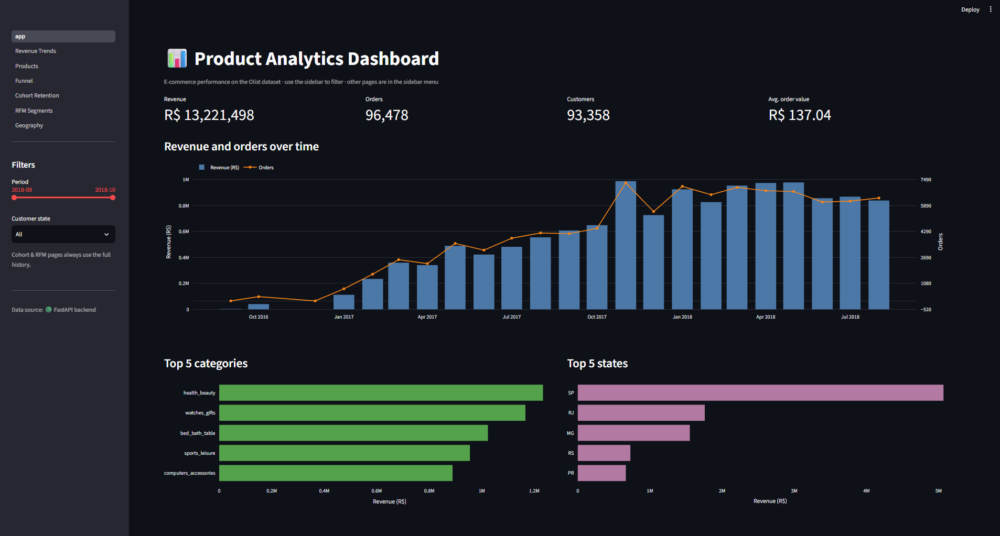
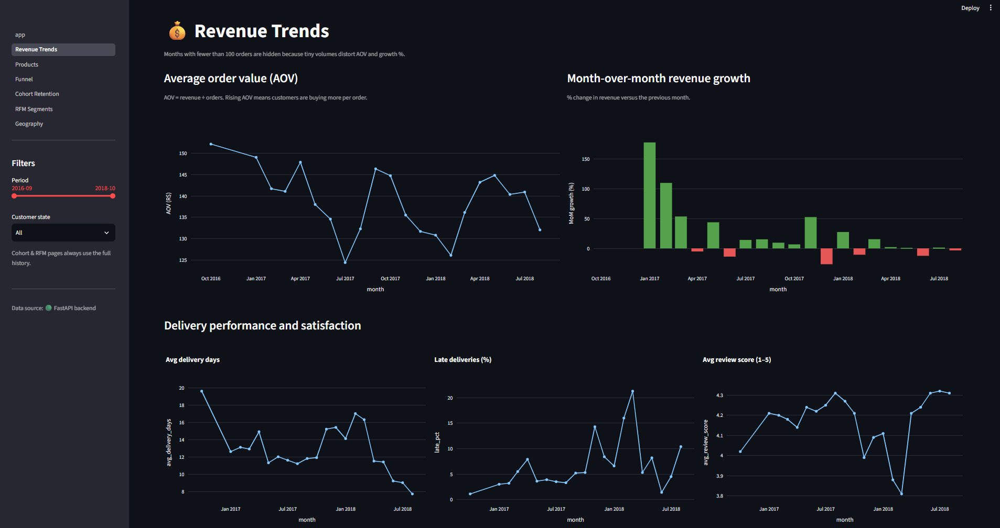
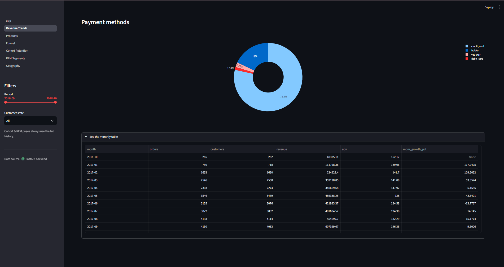
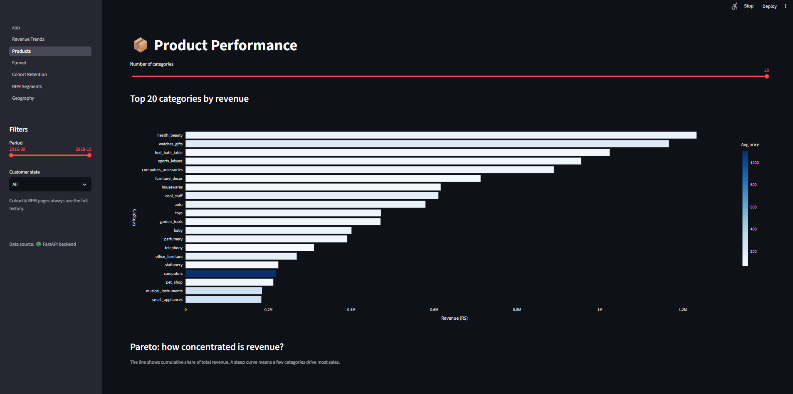
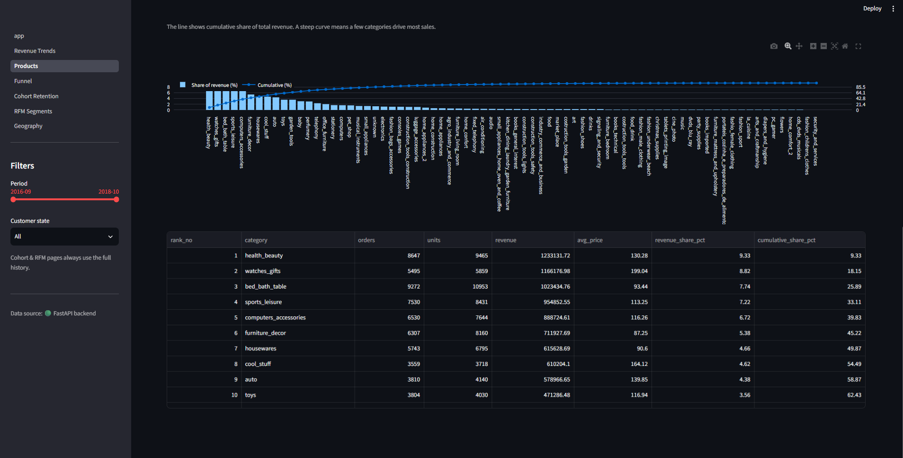
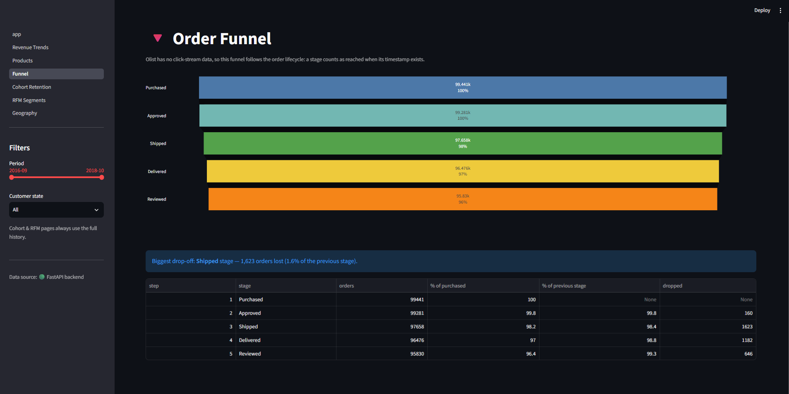
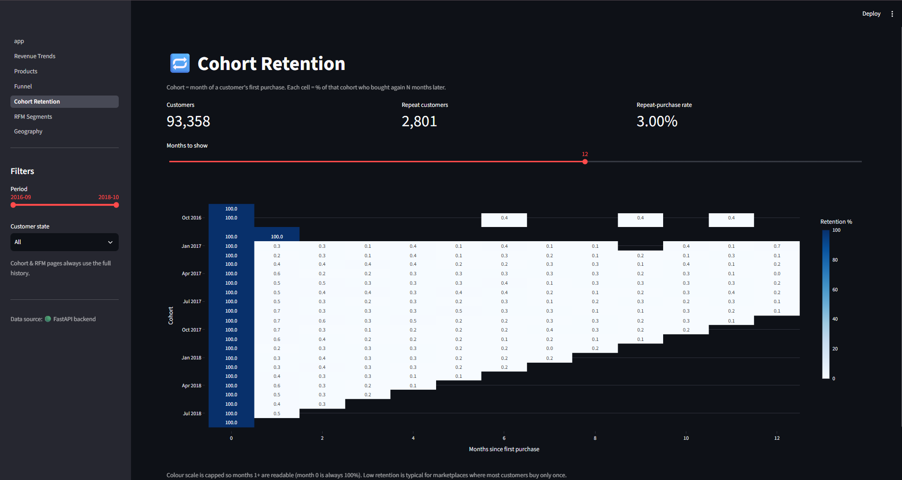
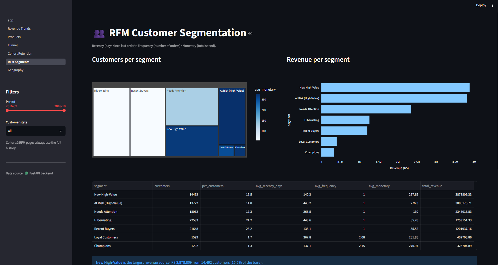
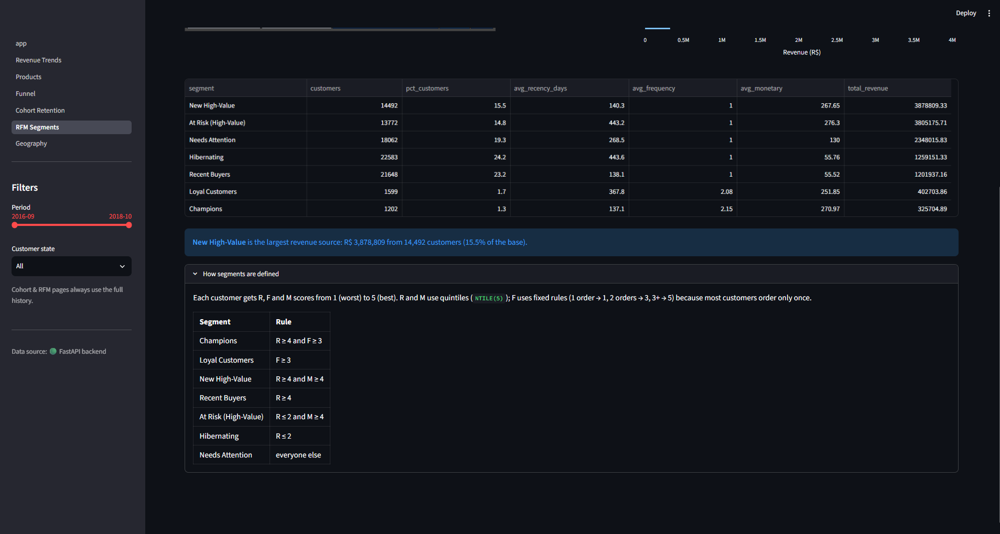

# 📊 Product Analytics Dashboard

End-to-end product analytics project on an e-commerce dataset (100K+ orders): raw CSVs → **SQLite** → **SQL analytics** → **FastAPI** backend → interactive **Streamlit + Plotly** dashboard.

It answers the questions a product/data analyst gets asked every week: *How is revenue trending? Which categories drive sales? Where do orders drop off? Do customers come back? Who are our best customers?*

## Dashboard preview



| | |
|---|---|
|  |  |
|  |  |
|  |  |
|  |  |

## Key insights

Based on 96,478 delivered orders (R$ 13.2M revenue, 93,358 customers) from late 2016 to 2018:

- **Growth came from order volume, not bigger baskets.** Monthly revenue rose from R$ 112K in Jan 2017 to roughly R$ 0.85–1M by late 2017, then plateaued. Average order value stayed in a narrow band of roughly R$ 125–152 throughout.
- **The top 10 categories generate 62% of revenue.** `health_beauty` (9.3%), `watches_gifts` (8.8%) and `bed_bath_table` (7.7%) lead; the top 5 account for 39.8%.
- **Categories win in different ways.** `bed_bath_table` has the most orders (9,272) at a low average price (R$ 93), while `watches_gifts` earns more revenue (R$ 1.17M vs R$ 1.02M) with about 40% fewer orders (5,495), thanks to a R$ 199 average price.
- **The order funnel is healthy.** 97.0% of orders reach delivery and 96.4% are reviewed. The largest drop is between approval and shipping (1,623 orders, 1.6%), so that is where operational fixes matter most.
- **Retention is the weak spot.** Only 3.0% of customers (2,801 of 93,358) ever ordered a second time, and month-1 retention is below 1% in every cohort. The business depends on constantly acquiring new customers.
- **Most revenue sits with one-time buyers.** "New High-Value" (14,492 customers) and "At Risk (High-Value)" (13,772 customers) together generate R$ 7.7M, or 58% of revenue, from 30% of customers. Repeat buyers (Champions + Loyal) are just 3% of customers and 5.5% of revenue.
- **Payments and geography.** Credit cards make up 78.5% of payment value and boleto 18%. São Paulo is by far the largest market, followed by RJ and MG.

### Recommendations

1. **Win-back campaign for "At Risk (High-Value)".** These 13,772 customers spent R$ 276 on average but have been inactive for about 14 months, and they account for 29% of revenue. Illustratively, every 1% reactivated is roughly 138 customers, or about R$ 38K at their historical average spend.
2. **Early-life retention for "New High-Value" customers.** With month-1 retention under 1%, a follow-up offer in the first 30–60 days targets the biggest recent spenders before they lapse.
3. **Investigate approval-to-shipping losses and late-delivery months**, since both affect satisfaction and cancellations.

### Caveats

- The funnel follows order lifecycle timestamps because the dataset has no click-stream data.
- Months with fewer than 100 orders (late 2016) are hidden from trend charts, since small volumes distort averages and growth rates.
- Customers are identified by `customer_unique_id`; recency in the RFM analysis is measured against the newest order in the dataset.

## Architecture

```
 Olist CSVs ──► scripts/load_data.py ──► SQLite (data/olist.db)
                                              │
                                   sql/*.sql  │  one file per analysis
                                              ▼
                                  FastAPI  (api/)   ──  JSON over HTTP, validated filters
                                              │
                                              ▼
                              Streamlit + Plotly (dashboard/)
```

Each layer has one job: **SQL computes, the API serves, the dashboard displays.** The dashboard talks to the API over HTTP and falls back to running the same SQL directly when the API is offline (useful for single-service hosting).

## Metrics and analyses

| Analysis | Definition | SQL file |
|---|---|---|
| Revenue | Sum of item prices on **delivered** orders | `kpis.sql`, `revenue_monthly.sql` |
| AOV | Revenue ÷ distinct orders | `kpis.sql` |
| MoM growth | Revenue vs. previous month (`LAG` window function) | `revenue_monthly.sql` |
| Product performance | Revenue, units, share, Pareto curve by category (`RANK`, windowed sums) | `top_products.sql` |
| Funnel | Purchased → Approved → Shipped → Delivered → Reviewed, from order timestamps | `funnel.sql` |
| Cohort analysis | Cohort = month of first purchase; retention % by months since | `cohort.sql` |
| Retention | Share of customers with more than one order | `retention.sql` |
| RFM segmentation | Recency/Frequency/Monetary scores (`NTILE`) → 7 segments | `rfm.sql` |
| Delivery & satisfaction | Delivery days, late %, review score by month | `delivery.sql` |
| Geography, payments | Sales by state, payment-method mix | `geography.sql`, `payments.sql` |

### Data-modelling decisions worth knowing
- **`customer_unique_id`, not `customer_id`.** In Olist, `customer_id` is regenerated for every order; only `customer_unique_id` identifies a person. Using the wrong one makes every customer look like a one-time buyer.
- **Row fan-out.** Joining `orders` to `order_items` repeats an order once per item, so order counts use `COUNT(DISTINCT order_id)`.
- **Only delivered orders count as revenue.**
- **The funnel follows the order lifecycle**, because the dataset has no click-stream (no views or add-to-cart events).
- **RFM frequency uses fixed rules.** Most customers order exactly once, so frequency quintiles would be meaningless.

## Quick start

Requires **Python 3.10+**.

```bash
git clone https://github.com/shambhavi1410/product-analytics-dashboard
cd product-analytics-dashboard

python -m venv venv
source venv/bin/activate          # Windows: venv\Scripts\activate
pip install -r requirements.txt
```

**1. Get the data**

Download the [Olist Brazilian E-Commerce dataset](https://www.kaggle.com/datasets/olistbr/brazilian-ecommerce) from Kaggle and place the 9 CSV files in `data/raw/`.

*No Kaggle account yet?* Generate a synthetic dataset with the identical schema to try the pipeline:
```bash
python scripts/generate_sample_data.py --orders 20000
```

**2. Build the database**
```bash
python scripts/load_data.py
```

**3. Start the API** (terminal 1)
```bash
uvicorn api.main:app --reload
```
Interactive API docs: http://localhost:8000/docs

**4. Start the dashboard** (terminal 2, with the venv activated)
```bash
streamlit run dashboard/app.py
```

**5. Run the tests**
```bash
pytest
```

## API endpoints

All metric endpoints accept `start` / `end` (`YYYY-MM`) and `state` (e.g. `SP`) filters.

| Endpoint | Returns |
|---|---|
| `GET /kpis` | revenue, orders, customers, AOV |
| `GET /revenue/monthly` | monthly revenue, orders, AOV, MoM growth |
| `GET /products/top?limit=10` | category ranking with revenue share |
| `GET /funnel` | order-fulfilment funnel |
| `GET /cohorts` | cohort retention matrix (long format) |
| `GET /retention/summary` | repeat-purchase rate |
| `GET /rfm` | RFM segment summary |
| `GET /geography` | sales by state |
| `GET /delivery` | delivery days, late %, review score |
| `GET /payments` | payment-method mix |

## Project structure

```
├── data/raw/            # Olist CSVs (not committed)
├── scripts/             # load_data.py, generate_sample_data.py
├── sql/                 # one .sql file per analysis
├── api/                 # FastAPI app (main.py) + DB helper (db.py)
├── dashboard/           # Streamlit app: app.py, utils.py, pages/
└── tests/               # API tests (pytest)
```

## Tech stack
Python · SQL (SQLite, CTEs, window functions) · pandas · FastAPI · Streamlit · Plotly · pytest

## Dataset credit
[Brazilian E-Commerce Public Dataset by Olist](https://www.kaggle.com/datasets/olistbr/brazilian-ecommerce) (CC BY-NC-SA 4.0). The data is not redistributed in this repository.
